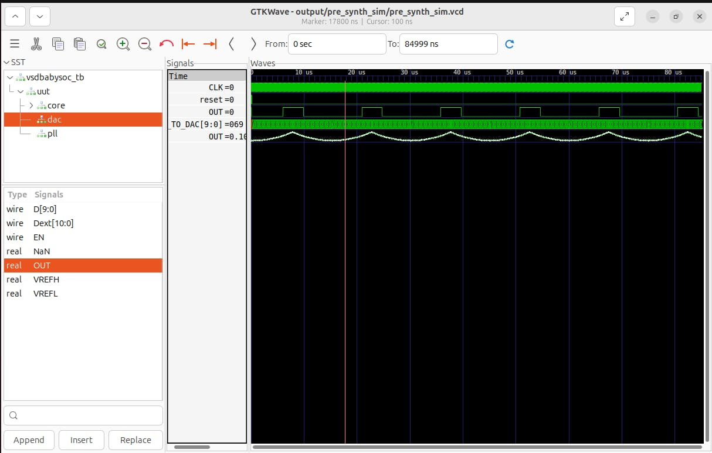
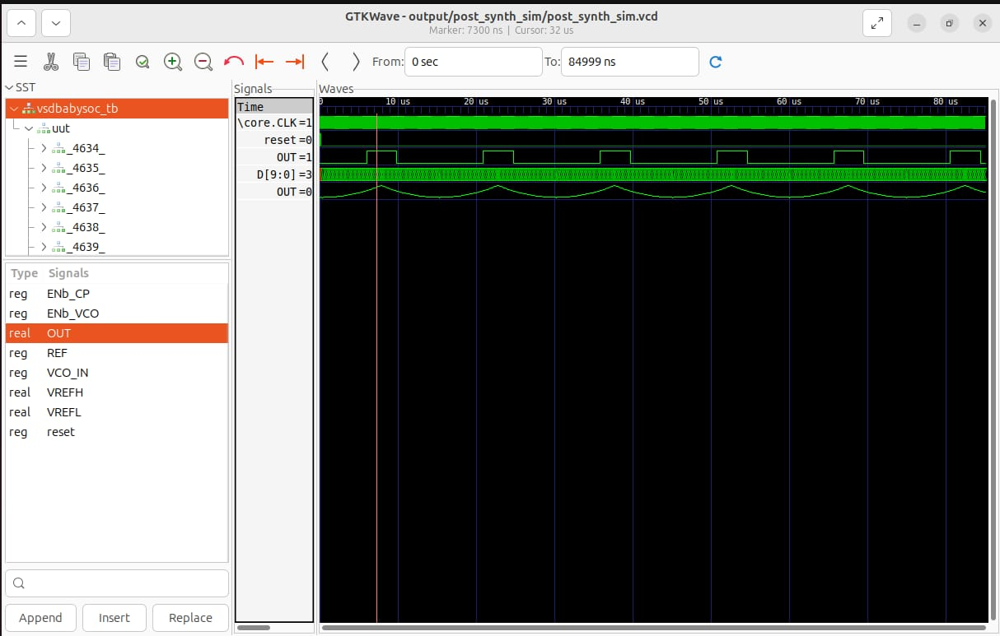

# RISC-V SoC Tapeout Program — VSD  
##  BabySoC — Fundamentals of SoC Design & Functional Modelling  

---

### 〰️ Pre-Synthesis Simulation  
Pre-synthesis simulation verifies the functional correctness of RTL under ideal conditions, ensuring the design behaves as intended before synthesis or hardware implementation.  

~~~bash
$ cd ~
$ git clone https://github.com/manili/VSDBabySoC.git
$ cd VSDBabySoC
$ make pre_synth_sim
$ gtkwave output/pre_synth_sim/pre_synth_sim.vcd
~~~

**Key Observations:**  
- **CLK** — Clock input to the `RVMYTH` core, generated by the PLL.  
- **reset** — Reset input to the `RVMYTH` core, from an external source.  
- **RV_TO_DAC[9:0]** — 10-bit digital output from register #17 of the `RVMYTH` core, driving the DAC.  
- **OUT** — Analog-like real signal output from the DAC, showing the conversion of digital values to analog behavior.  

---

### 〰️ Post-Synthesis Simulation  
Post-synthesis simulation validates that the synthesized gate-level netlist preserves functionality and meets timing, catching synthesis-induced mismatches or timing violations before tapeout.  

~~~bash
$ cd VSDBabySoC
$ make post_synth_sim
$ gtkwave output/post_synth_sim/post_synth_sim.vcd
~~~

**Key Observations:**  
- **core.CLK** — Clock input of the `RVMYTH` core, from the PLL.  
- **reset** — Reset input of the `RVMYTH` core, from an external source.  
- **D[9:0]** — 10-bit digital output of the `RVMYTH` core, corresponding to register #17, driving the DAC.  
- **OUT** — Analog-like real signal output from the DAC, validating digital-to-analog mapping post-synthesis.  

---

### 〰️ Reflection on BabySoC Journey  
BabySoC acts as the bridge between high-level RTL design and real-world SoC implementation.  
- It integrates a **RISC-V core (RVMYTH)**, **PLL**, and **DAC** into a minimal SoC framework.  
- Functional modelling (pre-synthesis) ensures correct logic design, while post-synthesis simulation validates hardware-level fidelity.  
- This step provides foundational confidence before advancing toward place & route and ultimately **tapeout**.  

---

<i>✅ Completed Week 2 tasks successfully — one step closer to SoC design mastery 🚀</i>

